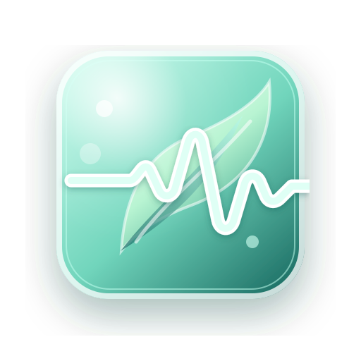

<div align="center">



# StressWatch · 心境

### 读懂身体发出的每一个信号

本地优先的 Apple Watch / Apple Health 健康趋势 App  
压力 · 恢复 · HRV · 睡眠 · 活动 — 全部在你的设备上完成

[打开产品官网](https://nanako-arasaka.github.io/StressWatch/) ·
[工作原理](https://nanako-arasaka.github.io/StressWatch/how/) ·
[隐私说明](https://nanako-arasaka.github.io/StressWatch/privacy/) ·
[更新日志](https://nanako-arasaka.github.io/StressWatch/changelog/)


</div>

---

## 产品一览

StressWatch 把手表与手机上的健康信号，收成一套可读、可解释的趋势参考——不是医疗结论，而是「你最近怎么样」的清晰叙事。

| 体验 | 说明 |
| --- | --- |
| **今日仪表盘** | 压力 / 恢复评分、HRV、睡眠、步数与活动，一屏读懂 |
| **实时压力** | 心率与 HRV 变化即时联动；可选 HRV 本地通知 |
| **AI 分析** | 状态预测 + 四维评分 + 关键变化、相关因素、数据质量 |
| **趋势** | 月度压力、分布与恢复热力图，把数字变成规律 |
| **睡眠分期** | REM / Core / Deep / Awake 自动拆解 |
| **每日打卡** | 一分钟记录情绪与能量，反哺个性化 |

<div align="center">

**Privacy by design**  
无需账号 · 多源 HealthKit · 可选私有 LLM · 数据默认不出设备

</div>

---

## 数据从哪来

```text
Apple Watch  ─┐
              ├─►  Apple 健康 / HealthKit  ─►  StressWatch（本机分析）
小米运动健康 ─┘         ▲
  （同步到 Apple 健康）  │
                        └─ 可选：自托管 LLM 代理（仅聚合 JSON）
```

- **主路径**：Apple Watch / HealthKit，只读、限流拉取（单次约 600 条）
- **路径 A**：小米运动健康 → Apple 健康，样本保留写入方，界面可标注来源
- **兜底**：权限不足时切换明确标注的 Demo Data，功能不崩溃

| 信号 | HealthKit 类型 |
| --- | --- |
| 心率 | `HKQuantityTypeIdentifier.heartRate` |
| HRV (SDNN) | `HKQuantityTypeIdentifier.heartRateVariabilitySDNN` |
| 静息心率 | `HKQuantityTypeIdentifier.restingHeartRate` |
| 睡眠分析 | `HKCategoryTypeIdentifier.sleepAnalysis` |
| 步数 | `HKQuantityTypeIdentifier.stepCount` |
| 活动能量 | `HKQuantityTypeIdentifier.activeEnergyBurned` |
| 锻炼时长 | `HKQuantityTypeIdentifier.appleExerciseTime` |
| 站立时间 | `appleStandTime`（iOS 18+） |

---

## 分析引擎

近期版本补全了本地分析链路——可解释、可扩展，而不是黑盒打分。

| 模块 | 作用 |
| --- | --- |
| **Personal Baseline** | 中位数 / 抗异常值统计，刻画「你自己的」基线 |
| **Stress & Recovery** | 个人化评分，拆成睡眠质量、活动负荷、HRV 等贡献项 |
| **TrendEngine** | 五状态长期走向，抑制单周噪声 |
| **CorrelationEngine** | 滞后相关（Pearson + Spearman），描述关联而非因果 |
| **Insight / Safety** | 关键变化、数据质量；LLM 输出经门控与校验 |
| **Core ML · 规则兜底** | 7 类分类器；不可用时同一套 6 状态词汇接管 |

```text
HealthKit 读取
    → 个人基线（稳健统计）
    → 特征提取（FeatureExtractor）
    → 压力 / 恢复 / 趋势 / 相关
    → 本地洞察（LocalInsightComposer）
    → 可选：AnalysisPayload → LLM 一次调用 → PersonalizationInsight
    → Dashboard / Analysis / Widget
```

> LLM 只接收你主动提交的**聚合 JSON**，不负责重算数值；默认路径完全在本机完成。

---

## 架构

模块化 MVVM：View → ViewModel → Protocol → Engine / Service → Storage / HealthKit。

```text
StressWatch/
├── App/                 # 应用入口、通知协调
├── Core/
│   ├── Analysis/        # 基线、评分、趋势、相关、洞察、LLM
│   ├── HealthKit/       # 只读采集与多源合并
│   ├── Models/          # 共享模型
│   └── Storage/         # 本地 JSON
├── Features/            # Dashboard · Trend · Analysis · Settings · Detail
├── Shared/              # Glass · Charts · Theme · Motion · Widget
└── Resources/           # Assets · Core ML
```

| 层 | 职责 |
| --- | --- |
| **Features** | SwiftUI 页面与 ViewModel |
| **Core** | 业务引擎与 HealthKit / 存储适配 |
| **Shared** | Liquid Glass 组件、图表、色板、动效 |

官网前端见 [`stresswatch-web/`](./stresswatch-web/)，与 iOS 工程独立。

---

## 设计语言

对齐 Apple Health / 产品页的克制表达：

- 单中性画布、单强调色、单阴影语言
- 大圆角玻璃卡片与轻量浮起
- 长曲线动效；支持「减弱动态效果」
- 浅色 / 深色模式
- 可解释文案：「趋势 / 参考」，避免医疗断言

---

## 隐私

**你的健康数据只属于你。**

| 承诺 | 说明 |
| --- | --- |
| 无账号 | 安装 + HealthKit 授权即用 |
| 无云端上传 | 默认分析与存储均在设备本地 |
| HealthKit 只读 | 不回写 Apple 健康 |
| 无分析 SDK | 无埋点、无崩溃上报 |
| 可选 LLM | 仅聚合摘要；自托管代理见 `server/` |

详见官网 [隐私页](https://nanako-arasaka.github.io/StressWatch/privacy/) 与仓库内架构文档。

---

## 开始使用

### 环境

| 项 | 要求 |
| --- | --- |
| 系统 | macOS |
| IDE | Xcode |
| 部署 | iOS 16.0+ |
| 设备 | iPhone 真机（HealthKit 必须真机验证） |
| 推荐 | Apple Watch（真实 HRV / 睡眠数据） |

### 打开工程

```bash
open StressWatch.xcodeproj
```

真机前检查：`StressWatch` scheme、Signing Team、Bundle ID、HealthKit capability、`NSHealthShareUsageDescription`。

### 真机自测清单

1. Clean Build Folder 后在真机运行  
2. 用 Demo Data 浏览 Dashboard  
3. 设置 → 请求 HealthKit → 切换到 Apple Health  
4. 确认多源徽章、指标兜底与 Demo 回退  
5. 浅色 / 深色 / 减弱动态效果  

### 产品官网

```bash
cd stresswatch-web
npm install
npm run dev
npm run build
```

已部署：<https://nanako-arasaka.github.io/StressWatch/>

---

## 医疗免责声明

StressWatch 仅用于**个人健康趋势参考**。

不提供医疗诊断、治疗建议、疾病检测或紧急服务。如有健康问题，请咨询合格专业人士。

---

## 路线图

| 状态 | 事项 |
| --- | --- |
| 近期 | TestFlight 内测、隐私政策定稿、App Store 截图 |
| 进行中 | 分析引擎打磨、自托管 LLM 代理 |
| 已落地 | HealthKit 多源、稳健基线、评分 / 趋势 / 相关、官网与 changelog |
| 规划 | Apple Watch 伴侣、锁屏 Widget、更多可解释可视化 |

完整变更见 [Changelog](https://nanako-arasaka.github.io/StressWatch/changelog/)。

---

## 仓库结构

| 路径 | 内容 |
| --- | --- |
| `StressWatch/` | **主实现** — 原生 SwiftUI iOS App |
| `stresswatch-web/` | 产品官网（GitHub Pages） |
| `server/` | 可选自托管分析代理 |
| `ml_training/` | 模型训练相关脚本 |

历史 Expo / React Native 原型可能仍在仓库中，**不是**当前主线。

---

<div align="center">

**Read every signal your body sends.**

开源 · 本地优先 · 可解释  
[GitHub](https://github.com/Nanako-Arasaka/StressWatch) · [官网](https://nanako-arasaka.github.io/StressWatch/)

<sub>个人学习与课程项目仓库。对外分发前请补充正式许可证。</sub>

</div>
